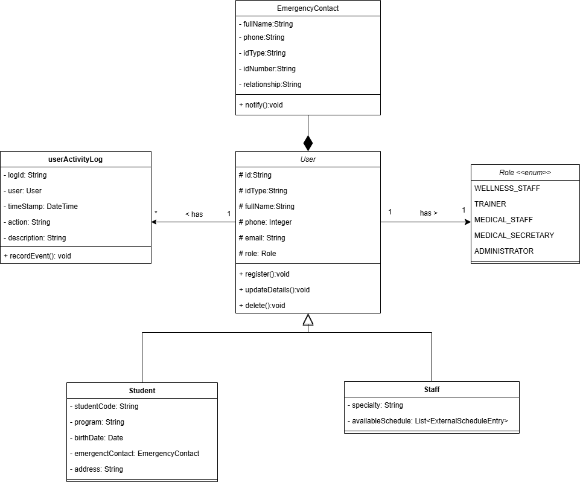
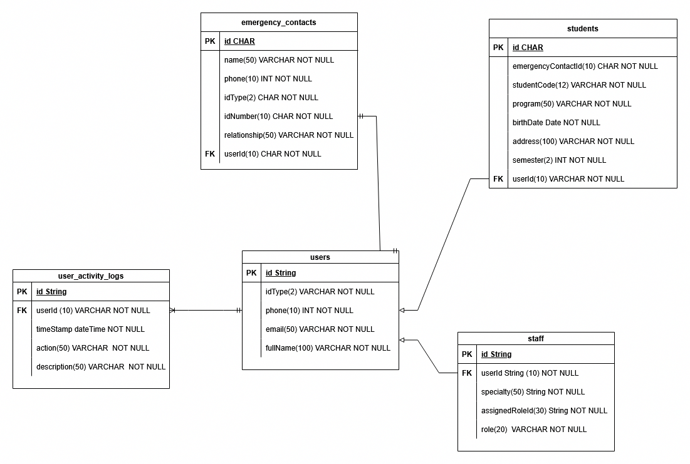
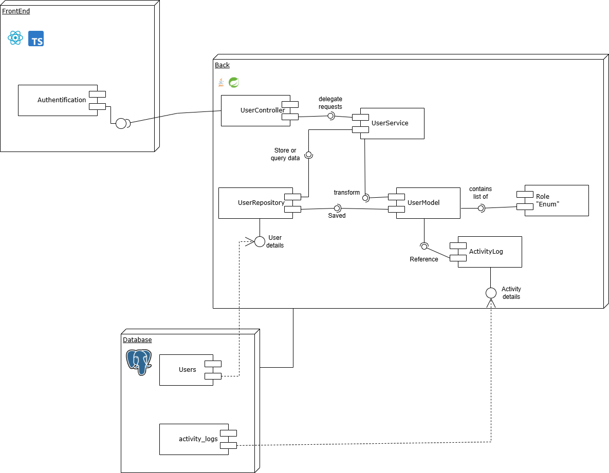
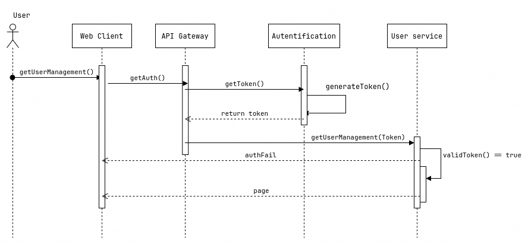
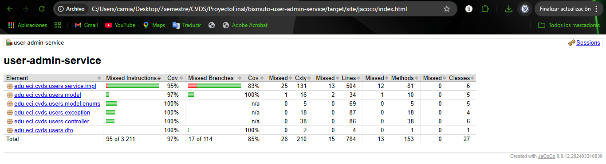
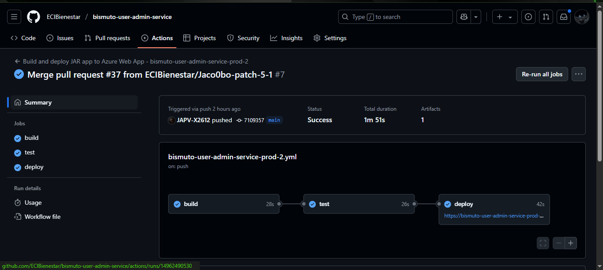
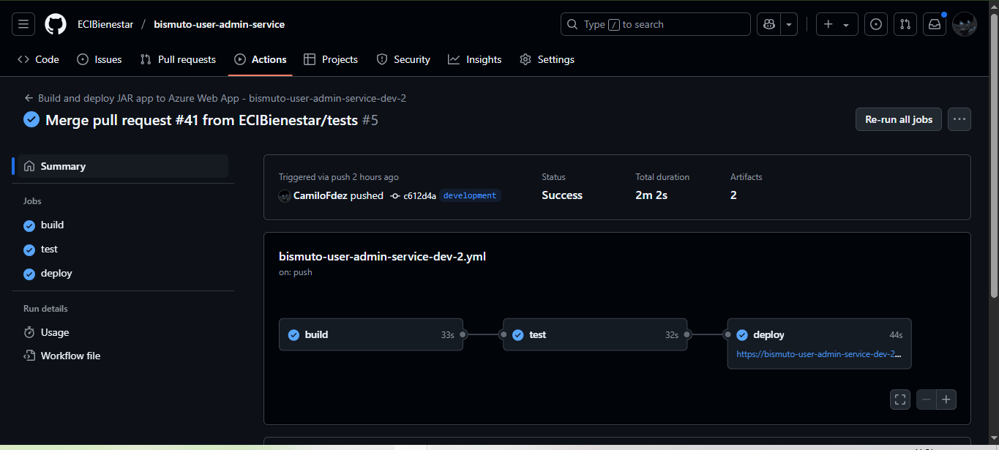
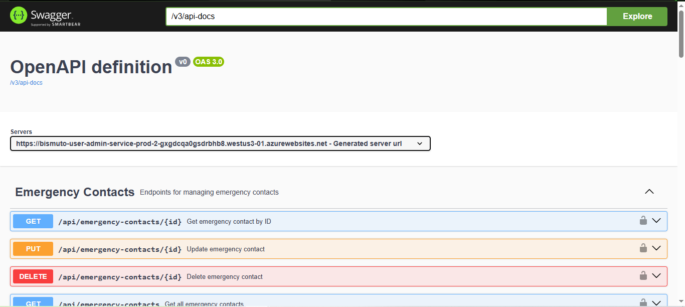

# ECI-Bienestar User Administration Service

User administration microservice for the ECI-Bienestar platform. Manages user profiles, roles, permissions, and scheduling configurations for wellness services at Escuela Colombiana de Ingeniería Julio Garavito.

## 👥 Authors

* Andrés Felipe Chavarro Plazas
* Andrés Jacobo Sepúlveda Sánchez
* Camilo Andrés Fernández Días
* Jesús Alfonso Pinzón Vega

## 📌 Project Overview
This microservice is part of the ECI-Bienestar integrated platform designed for Escuela Colombiana de Ingeniería Julio Garavito. The User Administration Service is built using **Spring Boot** and provides comprehensive user management capabilities including profile management, role assignment, and service scheduling configuration.

## 🛠️ Technologies Used
- **Java 17**
- **Spring Boot 3.x** (Spring Web, Spring Data)
- **MongoDB** (NoSQL Database)
- **Maven**
- **Lombok**
- **JUnit 5 & Mockito** (for testing)
- **JaCoCo** (for code coverage)
- **SonarCloud** (for code quality)
- **MapStruct** (for object mapping)

## 🔗 Microservices diagram


## 📂 Project Structure

```
bismuto-user-admin-service/
├── pom.xml
├── .gitignore
├── README.md
├── assets/
└── src/
    ├── main/
    │   ├── java/
    │   │   └── edu/eci/cvds/users/
    │   │       ├── UserAdminApplication.java
    │   │       ├── config/            # Configuration classes
    │   │       ├── controller/        # REST Controllers
    │   │       ├── dto/               # Data Transfer Objects
    │   │       │   └── enum/          # Enumerations
    │   │       ├── exception/         # Custom Exception Handling
    │   │       ├── model/             # Entity Classes
    │   │       ├── service/           # Business Logic Services
    │   │       └── util/              # Utility classes
    │   └── resources/
    │       ├── application.properties       # Default configuration
    │       ├── application-dev.properties   # Development configuration
    │       ├── application-prod.properties  # Production configuration
    │       ├── static/                      # Static resources
    │       └── templates/                   # Templates
    └── test/
        └── java/
            └── edu/eci/cvds/users/
                └── UserAdminApplicationTest.java
```
 
## 📐 Architectural style


## ⚙️ Internal functioning


## 

## 🚀 How to Run the Project

### Prerequisites
- Install **Java 17**
- Install **Maven**
- Set up a **MongoDB** database

### Steps to Run

1. Clone the repository:
   ```bash
   git clone https://github.com/ECIBienestar/bismuto-user-admin-service.git
   cd bismuto-user-admin-service
   ```

2. Configure database connection in `application.properties`:
   ```properties
   spring.data.mongodb.uri=mongodb://localhost:27017/eci_bienestar_users
   spring.data.mongodb.database=eci_bienestar_users
   ```

3. Build and run the application:
   ```bash
   mvn clean install
   mvn spring-boot:run
   ```


## 📑 Diagrams
Some of the diagrams proposed for this module are the following, which will help us to have a clear idea of ​​how the system works and is constructed:

### Clases
Represents the static structure of a system by showing its classes, attributes, methods, and relationships. It helps understand how objects are organized and related in an object-oriented system.




### Data
Shows the structure of data within the system, including entities, attributes, and their relationships. It is useful for database design and understanding how data is organized and linked.




### Components
Illustrates the physical and software components of a system and how they are grouped and connected. It helps visualize the architecture and module distribution of the application.




### Secuence
Describes how objects interact in a specific sequence of events over time. It focuses on the order of messages exchanged between objects to accomplish particular use cases or functions.




## 📌 API Endpoints

### AuthController Management

| Method | Endpoint                     | Description                                          |
|--------|------------------------------|------------------------------------------------------|
| POST   | /api/auth/validate           | Validate user credentials (email/password)           |
| PUT    | /api/auth/password/{userId}	 | Update a user’s password (requires current password) |

## EmergencyContactController Management
| Method    | Endpoint                        | Description                      | Required Role                                  |
|-----------|---------------------------------|----------------------------------|------------------------------------------------|
| POST      | /api/emergency-contacts         | Create a new emergency contact	  | ADMINISTRATOR, WELLNESS_STAFF                  |
| GET	      | /api/emergency-contacts/{id}    | Get emergency contact by ID      | 	ADMINISTRATOR, WELLNESS_STAFF, MEDICAL_STAFF  |
| PUT	      | /api/emergency-contacts/{id}	   | Update an emergency contact	     | ADMINISTRATOR, WELLNESS_STAFF                  | 
| DELETE	   | /api/emergency-contacts/{id}	   | Delete an emergency contact	     | ADMINISTRATOR                                  |
| GET	      | /api/emergency-contacts	        | Get all emergency contacts	      | ADMINISTRATOR, WELLNESS_STAFF                  |

## StaffController Management
| Method  | Endpoint                                | Description                           | Required Role                                   |
|---------|-----------------------------------------|---------------------------------------|-------------------------------------------------|
| GET	    | /api/staff/{id}                         | 	Get staff details by ID              | ADMINISTRATOR, WELLNESS_STAFF or self-access    |
| POST	   | /api/staff                              | 	Create new staff member              | 	ADMINISTRATOR                                  |
| POST	   | /api/staff/{id}/schedule                | 	Add schedule entry for staff         | 	ADMINISTRATOR or self-access                   | 
| DELETE	 | /api/staff/{staffId}/schedule/{entryId} | 	Remove schedule entry                | 	ADMINISTRATOR or self-access                   |
| GET	    | /api/staff/available                    | 	Get staff available on specific date | 	ADMINISTRATOR, WELLNESS_STAFF                  |
| GET	    | /api/staff/by-specialty                 | 	Get staff by specialty               | 	ADMINISTRATOR, WELLNESS_STAFF                  |
| DELETE	 | /api/staff/{id}                         | 	Delete staff member                  | ADMINISTRATOR                                   |

## StudentController Management
| Method  | Endpoint                             | Description                        | Required Role                                                |
|---------|--------------------------------------|------------------------------------|--------------------------------------------------------------|
| GET	    | /api/students/{id}                   | 	Get student details by ID         | 	ADMINISTRATOR, WELLNESS_STAFF, MEDICAL_STAFF or self-access |
| POST	   | /api/students                        | 	Create new student                | 	ADMINISTRATOR, WELLNESS_STAFF                               |
| PUT	    | /api/students/{id}                   | 	Update student information        | 	ADMINISTRATOR, WELLNESS_STAFF                               |
| GET	    | /api/students/by-program/{program}   | 	Get students by academic program  | 	ADMINISTRATOR, WELLNESS_STAFF                               |
| GET	    | /api/students/by-semester/{semester} | 	Get students by semester          | 	ADMINISTRATOR, WELLNESS_STAFF                               |
| DELETE	 | /api/students/{id}                   | 	Delete student                    | 	ADMINISTRATOR                                               |

## UserAdminController Management
| Method  | Endpoint                            | Description                               | Parameters                                                                   |
|---------|-------------------------------------|-------------------------------------------|------------------------------------------------------------------------------|
| PATCH   | 	/api/admin/users/{id}/status       | 	Activate/deactivate user account         | id: User ID <br/> active: boolean (true/false)                               |
| GET     | 	/api/admin/users/logs              | 	Get user activity logs                   | userId: Optional filter <br/> startDate,endDate: DateTime range (ISO format) |
| GET     | 	/api/admin/users/statistics        | 	Get system user statistics               | 	None                                                                        |
| PATCH   | 	/api/admin/users/{id}/role         | 	Change user role                         | 	id: User ID <br/> role: New role (e.g., "ADMINISTRATOR")                    |
| DELETE  | 	/api/admin/users/{id}/with-options | 	Delete user with options                 | 	id: User ID <br/> softDelete: boolean <br/> deleteAssociatedData: boolean   |
| DELETE  | 	/api/admin/users/all               | 	DANGER: Delete ALL users (irreversible)  | 	None                                                                        |

## UserController Management
| Method | Endpoint                   | Description                     | Required Role                   | Parameters                              |
|--------|----------------------------|---------------------------------|---------------------------------|-----------------------------------------| 
| GET    | 	/api/users                | 	Get all users                  | 	ADMINISTRATOR, WELLNESS_STAFF  | 	None                                   |
| GET    | 	/api/users/{id}           | 	Get user by ID                 | 	ADMINISTRATOR or self-access   | 	id: User document number               |
| PUT    | 	/api/users/{id}           | 	Update user information        | 	ADMINISTRATOR or self-access   | 	id: User ID <br/> body: UserRequestDTO |
| DELETE | 	/api/users/{id}           | 	Delete user                    | 	ADMINISTRATOR                  | 	id: User ID to delete                  |
| GET    | 	/api/users/by-role/{role} | 	Get users by role              | 	ADMINISTRATOR, WELLNESS_STAFF  | 	role: STUDENT, STAFF, etc.             |
| GET    | 	/api/users/by-email       | 	Get user by exact email        | 	ADMINISTRATOR, WELLNESS_STAFF  | 	email: Exact email address             |
| GET    | 	/api/users/search         | 	Search users by partial email  | 	ADMINISTRATOR, WELLNESS_STAFF  | 	email: Partial email string            |

### 📘 Accessing the Swagger Documentation

Once the project is running locally, you can access the auto-generated API documentation provided by **SpringDoc Swagger UI** at the following URL:
``` 
http://localhost:8080/swagger-ui/index.html
```
This interface allows you to:

- Explore all available endpoints
  
- Send test requests directly from the browser
  
- View request/response models and schemas

## 🧪 Running Tests

To run the unit tests:
```bash
mvn test
```

To generate test coverage report:
```bash
mvn test jacoco:report
```

## 📊 JaCoCo Code Coverage
To view the code coverage report generated by JaCoCo, open the following file in your browser:
```
target/site/jacoco/index.html
```
This report provides insights into the percentage of code covered by tests, helping identify untested areas.
Here's an example of the JaCoCo report:


## 🔄 CI/CD

This project uses GitHub Actions to automate building, testing, and deployment:

- **Development Pipeline**: Triggered by commits to `develop` and `feature/*` branches, automatically deploying to the development environment.
- **Production Pipeline**: Triggered by commits to the `main` branch, deploying to the production environment after successful tests.

Each pipeline consists of three stages:
1. **Build**: Compiles the application and creates the JAR package
2. **Test**: Runs unit tests and generates code coverage reports
3. **Deploy**: Deploys the application to the AWS environment

Configuration files are located in the `.github/workflows/` directory.

Heres an example of the CI/CD pipeline:
CI Pipeline:


CD Pipeline:


## 📦 Swagger documentation deployed
The Swagger documentation for the API is automatically generated and can be accessed at the following URL:
Production:
```
http://bismuto-user-admin-service-prod-2-gxgdcqa0gsdrbhb8.westus3-01.azurewebsites.net/swagger-ui/index.html
```

Development:
```
http://bismuto-user-admin-service-dev-2-cpfqe5cucuhqa6cz.canadaeast-01.azurewebsites.net/swagger-ui/index.html
```
This documentation provides a user-friendly interface to explore the API endpoints, request/response models, and test the API directly from the browser.

Deployment is managed through Azure App Service, ensuring high availability and scalability.
Here's an example of the Swagger documentation:



## 🔄 Integration with Other Modules

This user administration service integrates with other ECI-Bienestar modules:
- **Authentication Service**: For secure user identity management
How this module work with other modules?: 
This module is responsible for managing user profiles, roles, and permissions. It interacts with the Authentication Service to ensure secure access to user data and services. The Statistics Service uses this module to report user activity and service usage.
- **Statistics Service**: For user activity reporting
How this module work with other modules?:
This module collects and analyzes user activity data. It relies on the User Administration Service to obtain user profiles and service access information. The Statistics Service generates reports and insights based on this data, helping improve service delivery and user experience.
- **All service modules**: For providing user authorization and profile data
How this module work with other modules?:
This module provides user profiles and service access information to all service modules. Each service module checks user permissions and roles through the User Administration Service to ensure authorized access to specific services. This integration enhances security and ensures that users can only access services they are entitled to.

## Control of Errors
The module includes a comprehensive error handling mechanism to manage exceptions and provide meaningful feedback to users. It uses custom exception classes and a global exception handler to catch and process errors throughout the application.
The error handling mechanism includes:
- **Custom Exception Classes**: Define specific exceptions for different error scenarios, such as `UserNotFoundException`, `InvalidRoleException`, etc.
- **Global Exception Handler**: A centralized controller that intercepts exceptions and returns appropriate HTTP responses with error messages and status codes.
- **Error Response Format**: Standardized error response format to provide consistent feedback to API consumers. The error response includes:
  - `timestamp`: The time when the error occurred
  - `status`: HTTP status code
  - `error`: Short description of the error
  - `message`: Detailed error message
  - `path`: The request path that caused the error

Heres a table with the error codes and their descriptions:

| Status Code | 	Error Message            | 	Probable Cause                          | 	Recommended Action                      | 
|-------------|---------------------------|------------------------------------------|------------------------------------------|
| 400         | 	"Invalid input data"     | 	Failed form validations                 | 	Verify required fields and data formats |
| 401         | 	"Unauthenticated user"   | 	Missing or invalid authentication token | 	Provide valid credentials/refresh token |
| 403         | 	"Forbidden access"       | 	Insufficient permissions                | 	Check user role/request proper access   |
| 404         | 	"User not found"         | 	Non-existent user ID                    | 	Verify the user exists in the system    |
| 409         | 	"User already exists"    | 	Duplicate registration attempt          | 	Use a different email/document ID       |
| 500         | 	"Internal server error"  | 	Unexpected system failure               | 	Contact support with error details      |

## 📊 Key Features

- **Comprehensive User Management**: CRUD operations for user profiles
- **Role-Based Access Control**: Manage roles and permissions for different user types
- **Schedule Configuration**: Define availability for services and resources
- **Profile Management**: Maintain detailed profiles for all system users
- **Batch Operations**: Support for bulk user management operations

## 🏗️ Future Improvements

- Enhanced role hierarchy management
- Advanced scheduling algorithms for optimized resource allocation
- Improved integration with identity providers
- Self-service user profile management features
- Enhanced audit logging for user management operations

## 📝 License

This project is licensed under the MIT License.
